# Wireshark Network Traffic Analysis Lab

A hands-on network forensics project demonstrating real-world SOC analyst skills including live packet capture, traffic baselining, threat detection, and full incident triage of an active malware infection using Wireshark.

> This is the kind of work a Tier 1/2 SOC analyst does daily: identifying infected hosts, isolating C2 traffic, and documenting findings for incident response teams.

---

## What This Project Demonstrates

- Capturing and analyzing live network traffic in a security-focused Linux environment
- Identifying malicious traffic patterns including C2 beaconing, port scans, and protocol anomalies
- Extracting attacker IOCs and victim host details from raw packet data
- Writing professional incident reports suitable for SOC handoff or management review
- Proficiency with industry-standard tools used in security operations centers worldwide

---

## Tools and Environment

- **Wireshark 4.4.14:** primary packet analysis tool
- **Parrot OS:** security-focused Linux distribution (VirtualBox VM)
- **nmap:** network scanning for traffic generation and detection testing
- **tshark:** CLI-based packet analysis
- **PCAP Source:** [malware-traffic-analysis.net](https://malware-traffic-analysis.net), a trusted threat intelligence resource used by security professionals globally

---

## Project Structure

```
wireshark-lab/
├── screenshots/
├── pcaps/
│   ├── baseline_capture.pcapng
│   └── 2026-02-28-traffic-analysis-exercise.pcap
├── writeups/
│   └── incident_report.md
└── README.md
```

---

## Part 1: Live Capture and Traffic Baselining

Captured live traffic on a Linux host while generating real network activity via ping, HTTP requests, and an nmap service scan. Analyzed protocol distribution and top-talking hosts to establish a clean baseline, which is a critical reference point for anomaly detection.

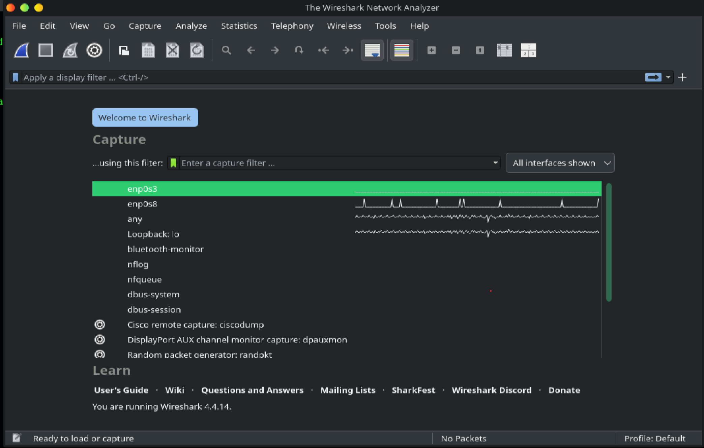
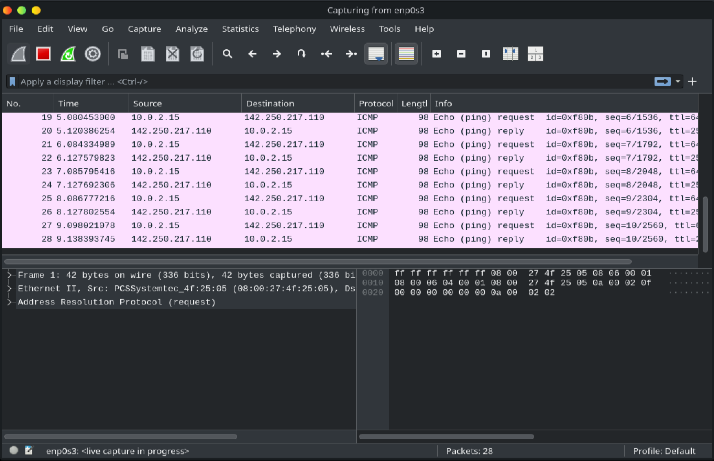
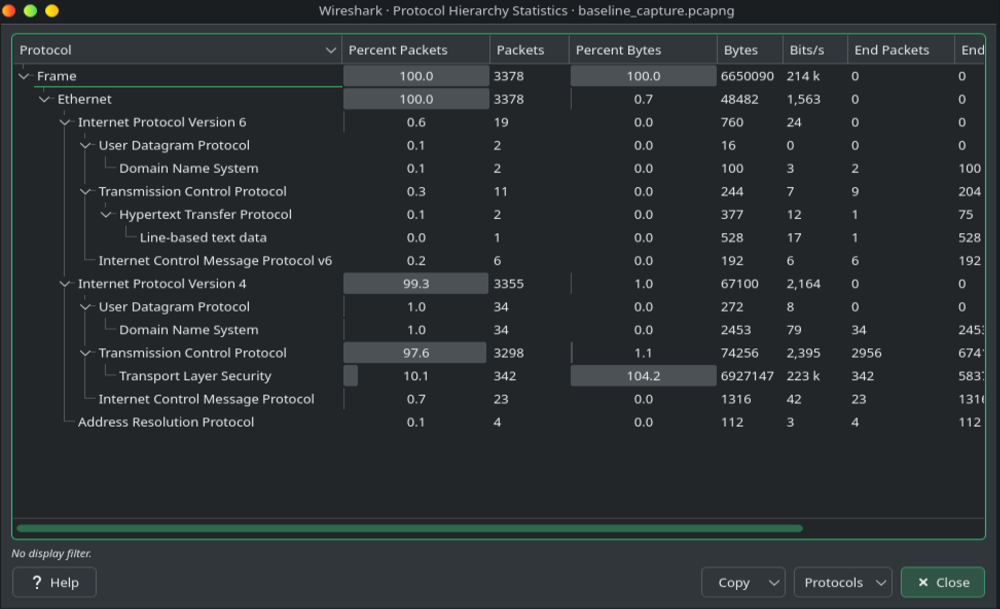
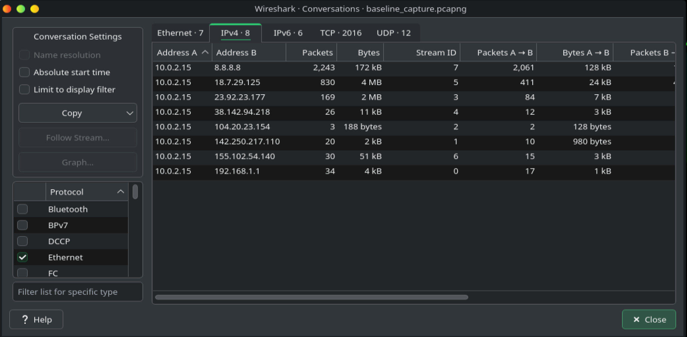

**Key findings:**
- TCP at 97.6%, driven by nmap scan activity
- TLS at 10.1%, confirming encrypted web traffic
- No cleartext credentials detected, all traffic over HTTPS
- Clean ARP behavior with no poisoning indicators
- ICMP request/reply pairs consistent with healthy connectivity

---

## Part 2: Display Filter Proficiency

Applied targeted Wireshark filters to isolate specific traffic types, which is the same workflow used in real SOC environments to cut through noise and find threats fast.

| Filter | Use Case | Finding |
|---|---|---|
| `dns` | DNS query monitoring | 36 packets, expected domains only |
| `tcp.flags.syn == 1 && tcp.flags.ack == 0` | Port scan detection | 2,012 SYN packets, nmap scan confirmed |
| `tcp.flags.reset == 1` | Rejected connection analysis | 125 RST packets, closed port responses |
| `http.request.method == "POST"` | Credential harvesting check | 0 results, no cleartext data exposed |
| `icmp` | Ping sweep and flood detection | 23 packets, clean baseline behavior |
| `arp` | ARP poisoning detection | 4 packets, normal gateway resolution |

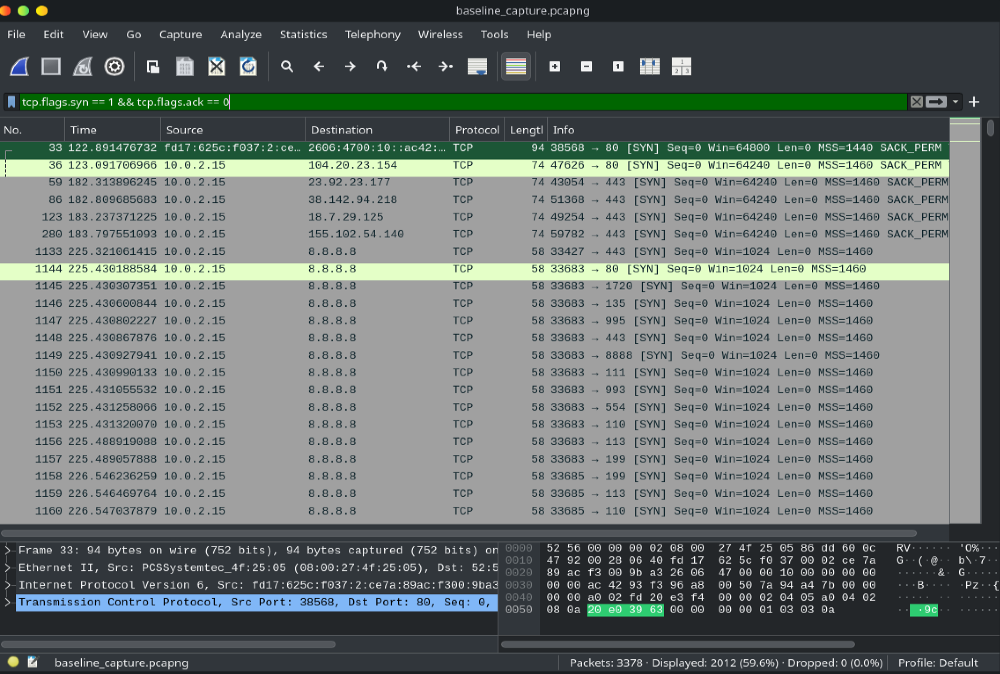
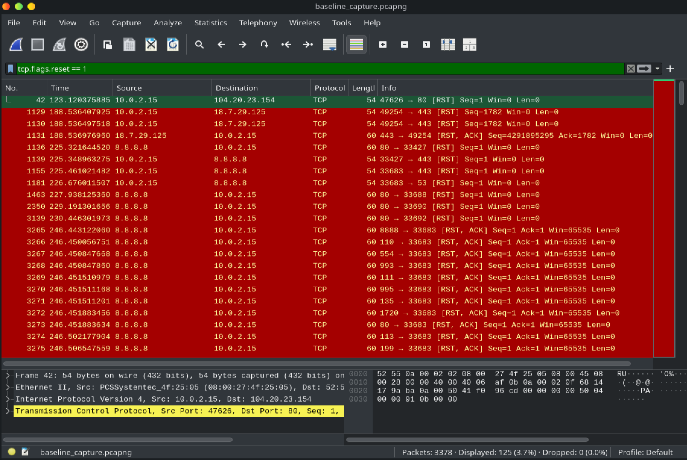
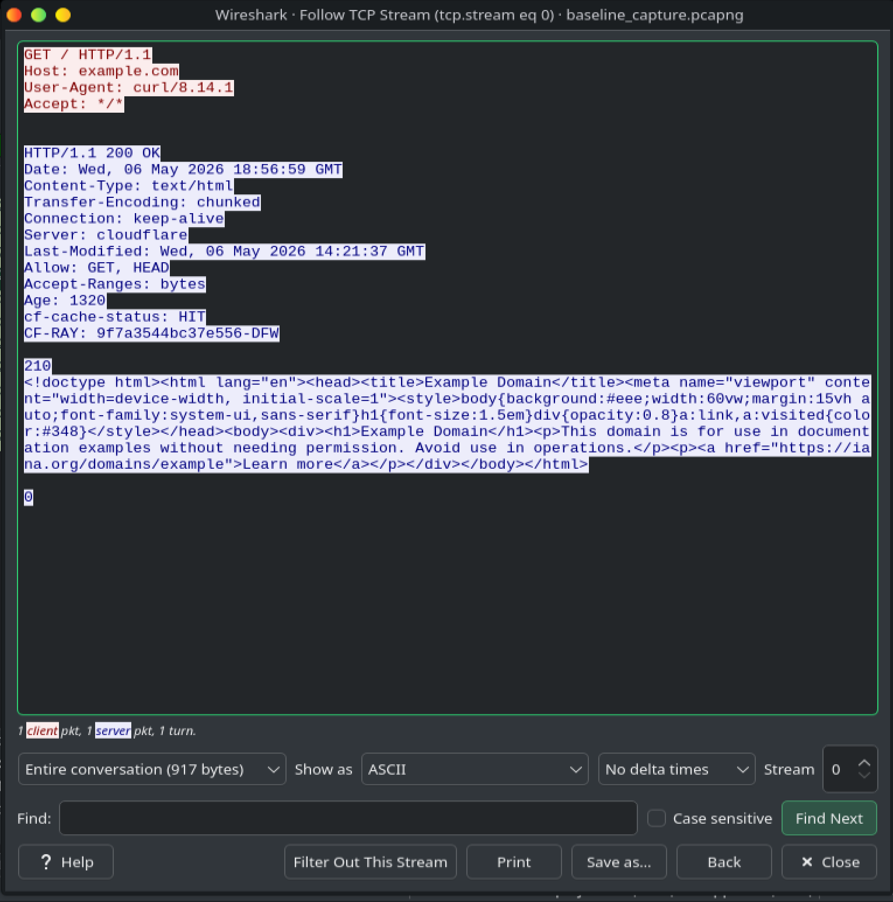

The TCP stream follow reveals the full HTTP transaction in plaintext, demonstrating exactly why unencrypted HTTP is a security risk and how analysts reconstruct sessions from packet data.

---

## Part 3: Malware PCAP Forensics and Incident Triage

The core of this project. Analyzed a real-world malware capture from [malware-traffic-analysis.net](https://malware-traffic-analysis.net) containing active NetSupport Manager RAT traffic, which is a remote access trojan seen in real enterprise incidents in 2026.

Performed full SOC-style triage starting from a single SIEM alert, identifying the infected machine, the compromised user account, and all relevant IOCs entirely through packet analysis.

---

### Threat Overview

| Field | Detail |
|---|---|
| Malware | NetSupport Manager RAT |
| C2 Server | 45.131.214.85 |
| C2 Port | TCP 443, disguised as HTTPS |
| Beaconing Pattern | Regular HTTP POST requests to /fakeu endpoint |
| Detection Source | SIEM signature alert |

---

### Triage Methodology

**Step 1: Isolate C2 traffic**
```
ip.addr == 45.131.214.85
```
Immediately surfaced 550 packets between the C2 and a single internal host, identifying the infected machine's IP in under 30 seconds.

**Step 2: Identify hostname and MAC**
```
nbns
```
NetBIOS name registration packets revealed the Windows hostname. MAC address was extracted from Ethernet frame headers.

**Step 3: Extract user account**
```
kerberos.CNameString
```
Active Directory Kerberos authentication traffic exposed the logged-in user account name in the AS-REQ cname field.

**Step 4: Resolve full name**
Used Wireshark's Find Packet function to search packet details for the surname, locating a SAMR QueryUserInfo response from the domain controller containing the user's full name.

---

### Victim Details: All Five IOCs Identified

| Field | Value |
|---|---|
| IP Address | 10.2.28.88 |
| MAC Address | 00:19:d1:b2:4d:ad |
| Hostname | DESKTOP-TEYQ2NR |
| User Account | brolf |
| Full Name | Becka Rolf |

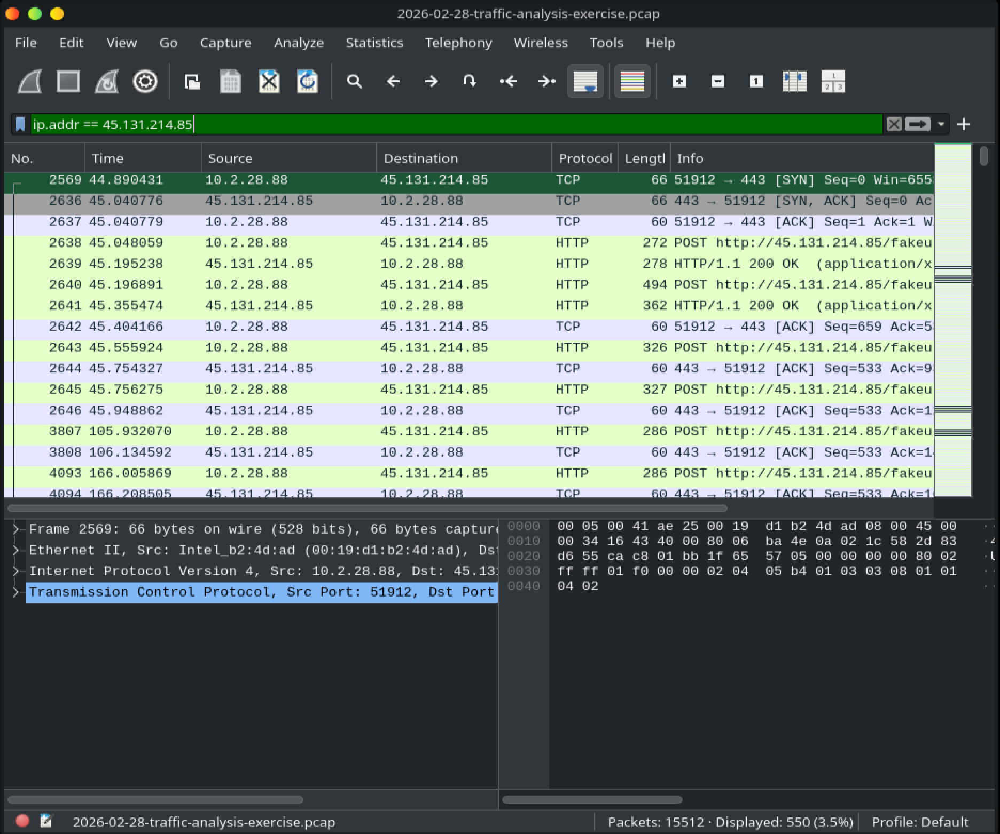
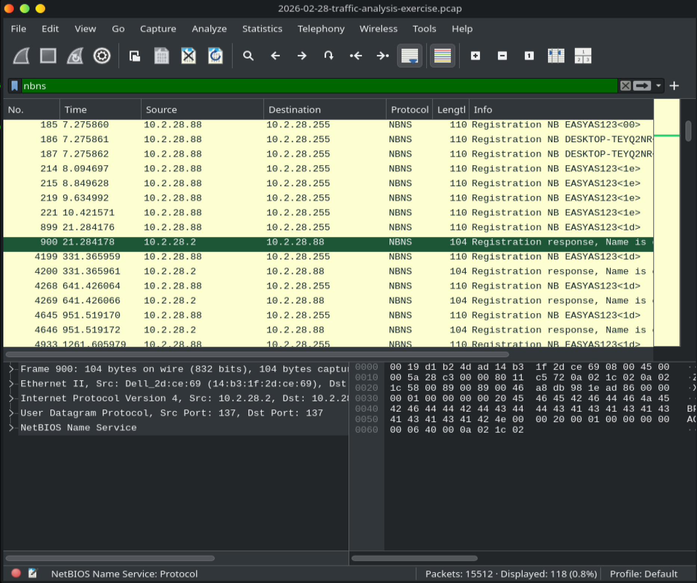
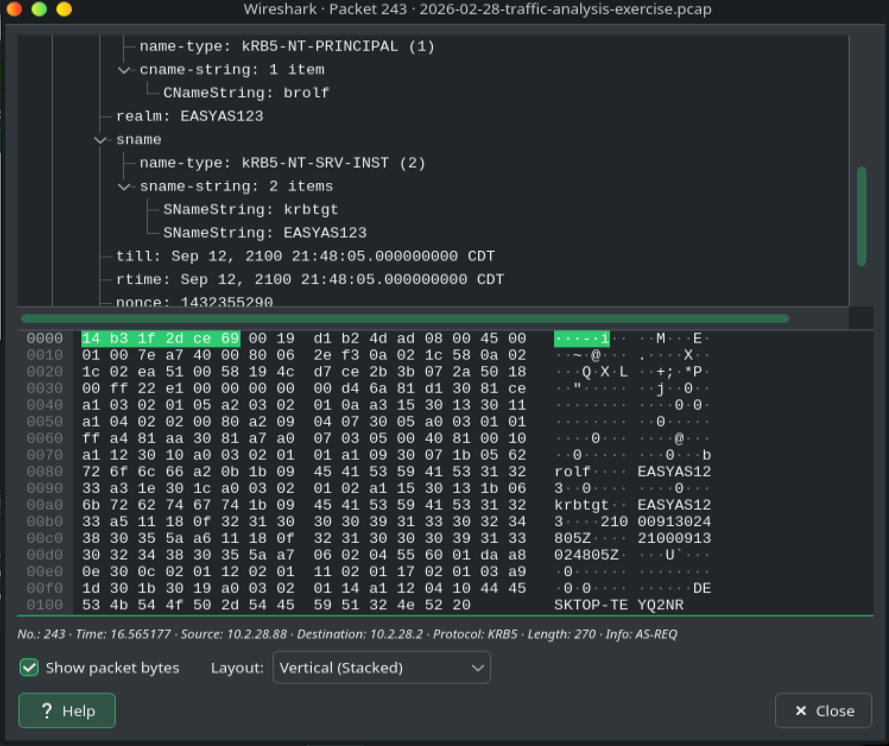
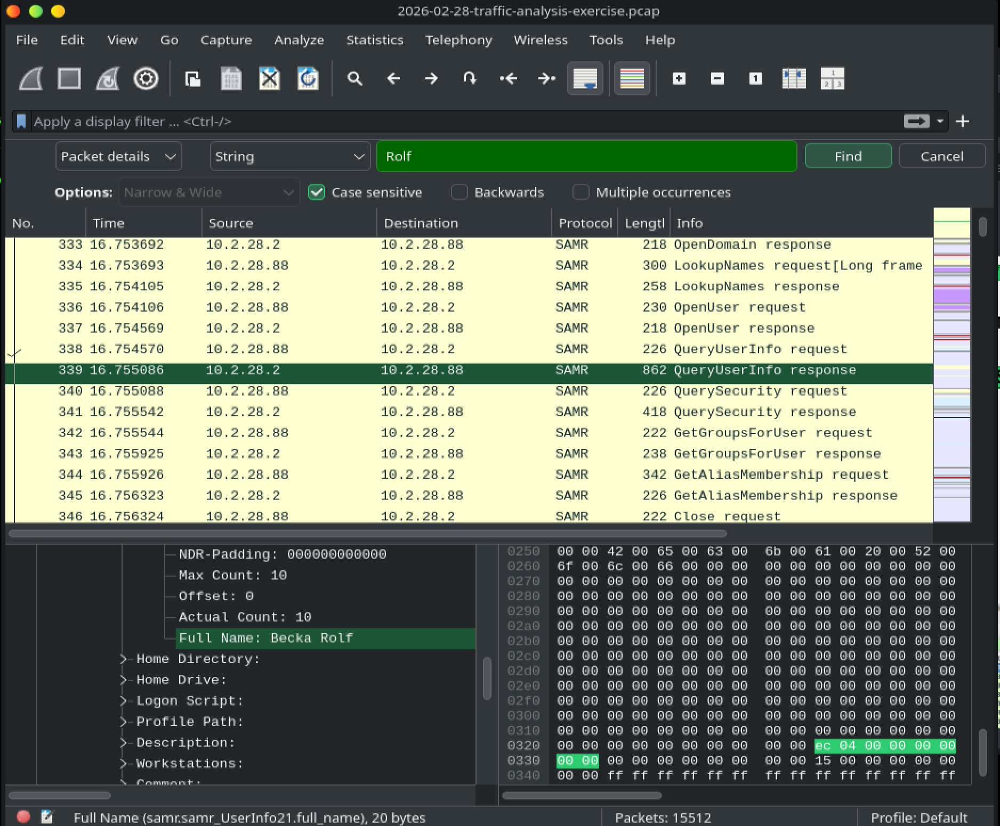

Full incident report with IOC documentation, timeline, and remediation recommendations available in [writeups/incident_report.md](writeups/incident_report.md).

---

## Skills Demonstrated

- Network packet capture and live traffic analysis
- Wireshark display filter development
- Threat detection through protocol and behavioral analysis
- Malware C2 identification and beaconing pattern recognition
- Host identification via NBNS, Kerberos, and SAMR forensics
- IOC extraction and professional incident documentation
- Security operations workflows from SIEM alert to full triage

---

## Related Projects

- [AD IAM Auditor](https://github.com/kl-nln/ad-iam-auditor)
  Live Active Directory security auditing with automated PDF and HTML report generation
- [Wazuh EDR Homelab](https://github.com/kl-nln/wazuh-edr-homelab)
  Open source EDR deployed across a multi-OS environment with brute force simulation and MITRE ATT&CK mapping
- [Python Security Automation Labs](https://github.com/kl-nln/python-automation-labs)
  18 production-ready security automation tools across AWS security, network recon, and threat detection
- [Splunk SIEM Lab](https://github.com/kl-nln/splunk-lab)
  SIEM environment with SPL queries built to detect authentication threats and anomalous behavior

---

## About

I am building a hands-on portfolio in cybersecurity and cloud security, focused on real-world skills that matter in security operations, threat detection, and incident response. This lab is one piece of a larger body of work documenting my technical progression.

Connect with me on [X/Twitter](https://x.com/kl_nln) | View my work on [GitHub](https://github.com/kl-nln)
